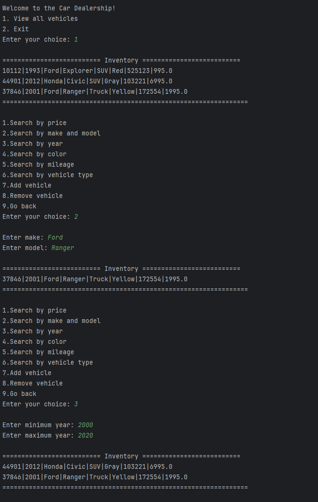
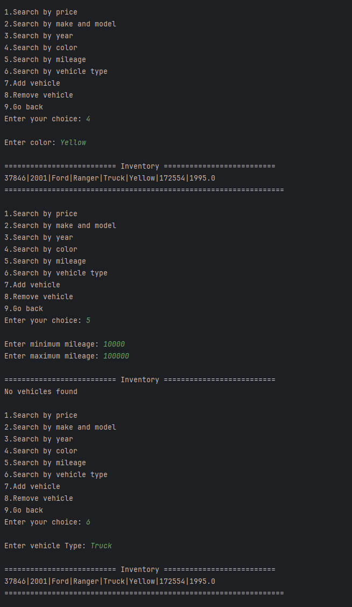
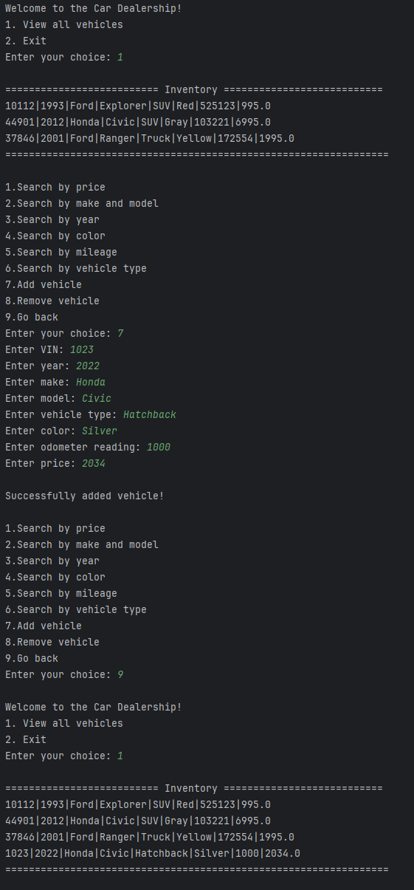
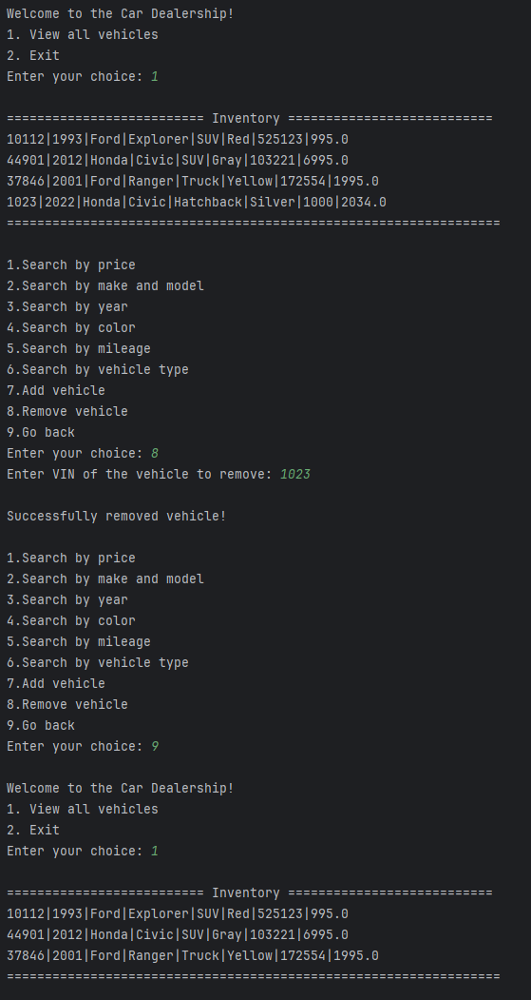

# Online Store
### Description of the Project

This is a console-based car dealership written in Java. It lets users browse a list of products, search by different parameters, as well as add and remove vehicles. 

## Prerequisites

    IntelliJ IDEA: Ensure you have IntelliJ IDEA installed, which you can download from here.
    Java SDK: Make sure Java SDK (version 17 or above) is installed and properly configured in IntelliJ.

Running the Application in IntelliJ

Follow these steps to get your application running within IntelliJ IDEA:

    Open IntelliJ IDEA.
    Select "Open" and navigate to the directory where you cloned or downloaded the project.
    After the project opens, wait for IntelliJ to index the files and set up the project.
    Find the main class with the public static void main(String[] args) method.
    Right-click on the file and select 'Run 'Main.main()'' to start the application.

Technologies Used

    Java 17
    File I/O (java.io package)
    Scanner
    File Writer
    java.time package
    ArrayList

Demo

\

## Interesting Piece of Code
One interesting piece of code I wrote was how I maintained **data persistence** by saving and retrieving dealership data from a CSV file.  
This allowed the application to **remember all vehicles** between program runs, meaning if the user adds or removes vehicles, those changes are stored permanently in `inventory.csv` and automatically retrieved in real time.
